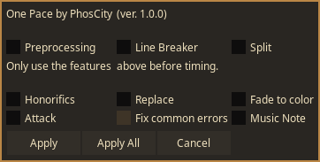
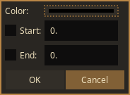

**_NOTE TO BE MERGED WITH MAIN BRANCH_**

This branch is only for macros written for a fansubbing group One Pace. If you're not part of the group, there may be very little here that may be useful to you.

When you run the script, you always first select the lines you want to be affected by the line, tick the checkbox that you want to run and click `Apply`. You can tick multiple checkboxes at once.

# Preprocessing

*Always run this before you do anything to the subtitle. Do not run this in a subtitle that has been timed, typesetted or QCed.* 

This does some preprocessing to the subtitle and prepares the subtitle for working. It performs the following action.

- Sorts all the lines of subtitle by time.
- Sets the resolution of the subtitle. If you have opened a video, the subtitle resolution is set same as the video resolution. If you have not opened a video, then a dialog will pop up allowing you to choose a subtitle resolution.
- Sets the subtitle info.
ScaledBorderAndShadow: yes
WrapStyle: 0
YCbCr Matrix: TV.709

- Add chapter markers and opening markers for subkt.
- Insert styles based on subtitle resolution.
- Change all lines' style to main.
- Fix common error in the subtitle.

# Line Unbreaker

This one is used for mass removing line breakers from the selected lines. However, it does not remove linebreaks from dashed lines (lines where multiple characters are speaking at once and the dialogues are separated by line breaker.)

# Split

This breaks the dashed lines and puts each character's dialogue in it's own separate line.

# Honorifics

This first makes the honorifics lowercase if the first letter of it is upper (seen in some base subs). Then it italicizes the honorifics.

# Replace

This replaces the terms in the subtitle in accordance to [this guide](https://drive.google.com/drive/folders/1Lz5ar9KHOskbQUw1FFLGsY3-7OpFp6Wc).

# Fade to color

When a scene fades to/from a solid color, use this to apply fade. You only have to choose a color and put start time (time when fade in ends) and/or end time (time when fade out starts). Then script will handle the rest.

# Attack

It applies a fade in and fade out of 150 ms in selected lines. Use this on named attacks.

# Music note

This is a stupid one. It only appends an eighth note on both ends of a line. Rarely used when a character is singing.
