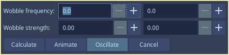
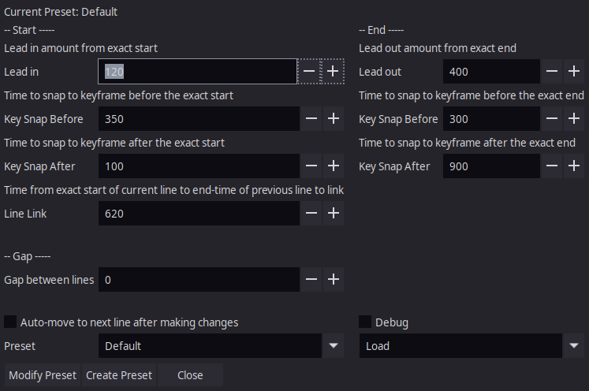
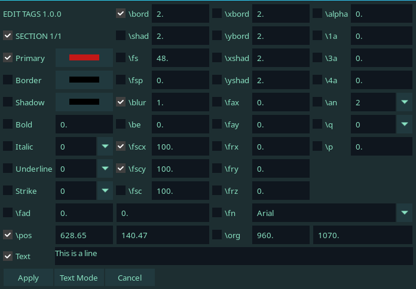
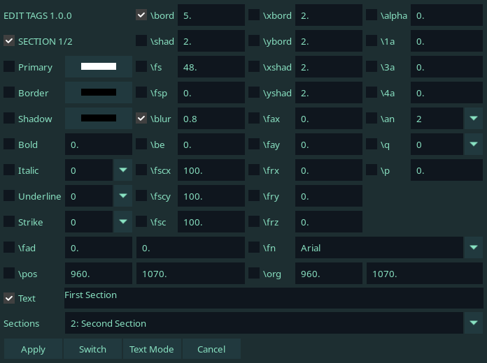
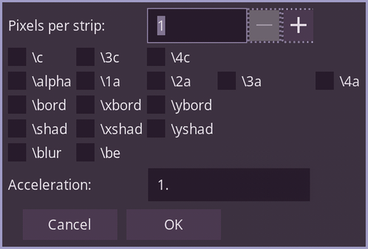
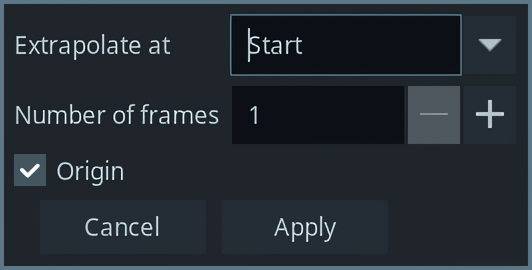

# PhosCity's Aegisub Scripts Collection

1. [Bidirectional Snapping](#bidirectional-snapping)
1. [Wave](#wave)
1. [Wobble](#wobble)
1. [svg2ass](#svg2ass)
1. [Timing Assistant](#timing-assistant)
1. [Remove tags](#remove-tags)
1. [Edit Tags](#edit-tags)
1. [QC Report](#qc-report)
1. [KFX](#kfx)
1. [Rotated Gradient](#rotated-gradient)
1. [Extrapolate Tracking](#extrapolate-tracking)

## Bidirectional Snapping

**_Available in Dependency Control_**

If you're a timer like me who does not use TPP and times primarily using hotkeys, then you'll be disappointed to know that Aegisub does not have hotkeys specifically for timing. While there are other scripts that allows you snap to keyframes, they are either a simple snap to adjacent keyframes or a TPP style snapping scripts. This one is geared towards timing.

While timing you might have come across the case multiple times where you go to the next line only to realize that the end time of the line overshoots the keyframe you want to snap to. Then you have no choice but to snap backwards using mouse. Here's where this script comes handy. This script is made to be hotkeyed, so first hotkey the end snapping and the start snapping function in the audio section. When you press the hotkey to snap end once, it snaps to the keyframe ahead. If you press the same hotkey again, it snaps to the keyframe behind. Then every press of the hotkey will continue snapping to previous keyframe. This way, you can snap to the keyframe ahead or behind using the same hotkey. For the start time, the opposite happens. One press snaps behind and then double press snaps forward.

I use Bidirectional Snapping in combination with [this script](https://github.com/The0x539/Aegisub-Scripts/blob/trunk/src/0x.JoinPrevious.lua) which is also hotkeyed and allows me to link the previous line to current line without moving to previous line.

An attempt has been made below to showcase it's usage but you should use it yourself to see how it works. Here, `w` has been hotkeyed to end-snapping and `q` has been hotkeyed to beginning-snapping.

https://user-images.githubusercontent.com/65547311/168461607-d575b757-4504-4a31-8c9b-f52d01fe566f.mp4

## Wave

**_Available in Dependency Control_**

Wave is a script that allows you to mimic the wavy signs through some fscx, fscy and fsp trickery. When you open the scripts, there are few parameters you can change and you'll have to go through some trial and error to determine what values give you the result you want.

Credits for the original code excerpt before my modification goes to [The0x539](https://github.com/The0x539)

Below are few examples of what kind of waves you can achieve but depending on the values you use, you can create different types of waves as well.

https://user-images.githubusercontent.com/65547311/164889225-2d8a6ccf-7798-4810-a3cf-3f87568abef0.mp4

## Wobble

**_Available in Dependency Control_**

Wobble is a remake of a very old script that distorts the text with the parameters you choose. The old script however was very difficult to use. It neither recognized the text already present in the line nor the tags used nor did it output the result in a usable format. So I decided to remake it and add other features.

When you open the script, you will be presented with the GUI as shown above. Imagine that when you use this script, it distorts the text along a wave horizontally or vertically or both. The parameters control the nature of the wave thus controls how the text is distorted. Frequency is the number of waves (crest and trough) you want in the text in percentage. You'll most likely use 20-40% for optimum results. Strength is the number of pixels that the text will be distorted to. With trial and error, you can create many interesting distortions.

As you can see below, the top is the original font and everything below it is distorted using this script. I use it when the sign is distorted or I need an irregular font that I cannot find.

If you want to animate the distortion, first split the line to frames. You can use something like [petzku's script](https://github.com/petzku/Aegisub-Scripts/blob/master/macros/petzku.SplitTimer.moon) to do so. You can control the speed of animation by controlling the number of frames each line has. The more frames per line, the slower the animation. After splitting the line to frames, you need to put the starting value and ending value. I recommend you figure this out beforehand by using main GUI. After you put the starting and ending value for all the required elements, click on `Animate` and the script will handle the rest.

  
Click here to see example animations

  
https://user-images.githubusercontent.com/65547311/179356858-4179c754-93ad-4bdf-b4fe-befc0546d33e.mp4

https://user-images.githubusercontent.com/65547311/179356862-a29a5b9d-9cb3-4cb9-b7c2-e6c5269063ef.mp4

Again, split the lines into frames first. Then, you need to put the middle value. After that you need to put the factor by which the middle value will change. If your middle value if x and factor is y, the minimum value is x - y while the maximum value is x + y. The values will oscillate from minimum value to maximum value. The steps box is the rate by how much the value changes per line.

  
Click here to see example oscillation

  
https://user-images.githubusercontent.com/65547311/179356869-f5294d5a-ea76-455f-9ec0-7749bbb223fd.mp4

## svg2ass

**_Available in Dependency Control_**

The script svg2ass is a wrapper for a program [svg2ass](https://github.com/irrwahn/svg2ass) which allows you to select a svg file from Aegisub itself and convert it to shape, clip or iclip. It works in both windows as well as unix operating system. I generally create svg files using GIMP(can perform complex selections and convert those selections to svg in a matter of seconds) or Inkscape and use svg2ass to convert them to subtitle lines. If you cannot/ do not want to compile svg2ass, then there is also a [website](https://qgustavor.github.io/svg2ass-gui/) where you can upload the svg file to obtain the output.ku

The first thing you should do is to set the config and provide the path where you have the svg2ass executable. At the same time, you can also provide custom tags you want to append to final result and the custom svg2ass parameters if you prefer.

To use this script, simply click on `Import` button and select the svg file. The resulting lines will have the same start time, end time and style as the selected line. If you checked clip or iclip in the gui, the resulting shape will be converted to clip or iclip respectively. Alternatively if you don't have the svg2ass executable, you can get the output of svg2ass from the website and paste the result in the textbox and click on the `Textbox` button. The resulting lines will the same as `Import`

## Timing Assistant

**_Not Available in Dependency Control_**

I made this script knowing full well that no experienced timer would use this but I had to because I loved TPP's convenience but hated that it was too unintelligent to require a separate pass to fix all the errors it generated.

Rationale:

When I time, I always make a series of decision for every line. Do I need to add lead in, lead out, snap to keyframes or link the lines? So I wanted to create a script that allows me to do it in a press of a hotkey. Someone just rolled their eyes and said, "Phos, you just made an inferior TPP". It might be inferior but it is definitely not a TPP. The workflow of using this script is the same as timing without TPP but only difference is that the aforementioned decisions is made for you by the script.

How to use:

The first thing to do after you install the script is to set up the config. By default, it contains the values I use and what I consider sane defaults. You are however free to change it and the script will perform as intended as long as the values you put are within reason. The second thing to do is of course hotkey the script in audio section.

Now you are ready for timing. Here, you'll first do the exact timing on the line and then press the hotkey. The script will make the decision for you whether it should add lead in, snap to keyframe, link the lines together or add lead out. You then move to the next line and repeat. _Exact time, hotkey. Exact time, hotkey. That's it._

I have come to like this method because it has the convenience of decision making of TPP but at the same time, if I do not agree with the script, I am free to fix it and move to next line.

**Note**: If the end time of your line exceeds the audio of next line, don't fix it. Go to the next line, exact time it and then press the hotkey. The script will fix it. It works in this manner because it can only make proper decision of line linking of current line in context of start time of next line.

**Note2:** This is just the first release of the script and I understand that it'll not be perfect right now but as I keep timing with it and come across edge cases where it fails, I'll be sure to improve it where I can.

If you want to to check exactly what steps the script takes for decision making, expand the following and let me know if I got something wrong.

  
Click here to expand

For start time:

1. If start time is already snapped to keyframe, it does not make any changes to the start time.
1. Checks if there is a keyframe within the time specified in the config and snaps to it.
1. If it was not snapped, it checks the end time of previous line and if it is within the linking time specified in config, it adds lead in to current line and extends the end time of the previous line.
1. If it was neither snapped nor linked, it simply adds lead in.

For end time:

1. If end time is already snapped to keyframe, it does not make any changes to the end time.
1. Here's a special step that is only applicable when your keyframe snapping value is greater than 850 ms. Snapping to keyframes more than 850 ms away is not always the correct thing to do, hence this special step. If the script finds that there is a keyframe 850+ ms away from exact end and you've allowed to snap to that distance in config, then it first checks cps of the line (without leadout). If cps is greater than 15, then it snaps to keyframe. If the cps is less than 15, then it either tries to add lead out to the line or extend the end time such that it is 500 ms away from keyframe whichever is lesser.
1. If above special case is not true(which is most of the case), it simply checks if there is a keyframe within time specifed in the config and snaps to it.
1. If it did not snap, it simply adds lead out to the line.

## Remove Tags

**_Not Available in Dependency Control_**

_Lyger's module is a dependency. If you have downloaded lyger's script from dependency control, chances are you already have it. You can also get it from [here](https://github.com/TypesettingTools/lyger-Aegisub-Scripts/blob/master/modules/LibLyger.moon)_

This is undoubtedly a clone of unanimated's script called `Script Cleanup` but there are two major differences. The first being that as the name suggests, this script only has the portions of `Script Cleanup` that deals with removing tags. The second being that the GUI of this script is dynamically generated i.e. only tags that are available in the selected lines are available for you to remove.

### `Remove All` button

- If you simply click the `Remove All` button, it removes all the tags form the selected lines.
- If you check `Start tags` in the top row and then press `Remove All` button, it removes all start tags from selected lines.
- Similarly, checking `Inline tags` in top row removes all inline tags.

### `Kill Tags` button

- All the tags that you individually selected would be removed.
- If `Start tags` is checked, the selected tags will only be removed from start tags.
- If `Inline tags` is checked, the selected tags will only be removed from inline tags.
- If `Transform` is checked, the selected tags will only be removed from transforms.
- If `Inverse` is checked, all the tags except the selected ones will be deleted.

### `Run Selected` button

This button executes the things you select in the left column and is mostly used to delete groups of tags at once. Staying true to it's mission, the script also dynamically creates this section. Which means that if your selection does not contain any color tags, the option to remove color tags won't be available. The groups available are:

- All color tags (c, 1c, 2c, 3c, 4c)
- All alpha tags (alpha, 1a, 2a, 3a, 4a)
- All rotation tags (frz, frx, fry)
- All scale tags (fs, fscx, fscy)
- All perspective tags (frz, frx, fry, fax, fay, org)
- All inline tags except last (useful for undoing gradient)

## Transform button

This button is only available to you if there are transforms in your selection. The idea for this is to easily select a specific transform that you want to delete. Each row has transforms for a single line. If you have a line with dozens of transforms, the gui produced will be very wide so keep that in mind. Simply select the transforms you want to delete and click `Remove`

## Edit Tags

**_Not Available in Dependency Control_**

The main idea is that it presents the tags and it's value of the current line in a HYDRA like GUI so that I can easily edit the values of that tag. It is mostly useful for complex lines that has a lot of tags. It separates start tags, inline tags and transforms in different sections for easy editing.

When you run the script on this line, following gui is generated:

As you can see the gui looks very much like HYDRA. The tags present in your lines are ticked and the effective tag values are pre-filled. Here effective tags value means if the tag is not available in the line, the tag value is taken from style. Not only you can change the value of the ticked tag in the gui but you can also tick any tags of the gui to add that tag to the line. The order of your tags are respected.

While I did not plan to add an option to modify tags in multiple lines, I added an option nonetheless. It's usefulness is highly doubtful. I took inspiration from unanimated's Modifire. In short, if you select multiple lines and run the script, following gui will be shown which shows tags in all the selected lines without duplication. It's essentially find and replace for tags i.e. if you change the value of the tag in the gui, all the instances of that said tag will be modified.

## QC Report

**_Not Available in Dependency Control_**

This script is designed to write and generate QC reports from Aegisub. If you wish to write QC reports using a media player, there is a program called [mpvQC](https://github.com/mpvqc/mpvQC) which is designed to do just that.

The top row of the gui consists of configurable sections like timing, typesetting etc that you can tick to specify the type of note. If nothing is ticked, it's treated as a general note. Below that is a drop-down which has pre-made reports for each sections for making even faster notes.

Below that is a textbox where you are free to write you report. The way you format your report in the textbox is preserved. If you selected any pre-made reports, it is appended to the beginning of the text in the text-box. You can leave this box empty and only select the pre-made report.

Finally, there is a checkbox called `Use video frame`. Normally, the report is added to current line but if you tick this, the report is added on the basis of the current video frame. If the current video frame has a subtitle, then the report is added to that line. If there isn't, then an empty line with report is inserted whose time is same as the video frame.

After you write all your notes, you can generate a report and a properly formatted note will with time will be generated that you can copy and share. The generated report is fully compatible with arch1t3cht's [Note Browser](https://github.com/arch1t3cht/Aegisub-Scripts#note-browser) script. After you generate the report and you no longer need them in your subtitle, you can clean them up too.

There is also a config where you can configure a lot of things about the script so be sure to check that out.

## KFX

**_Not Available in Dependency Control_**

https://user-images.githubusercontent.com/65547311/177035842-e1a4b930-07b8-4ea0-82a2-16a3de8552e6.mp4

This script is designed to write or modify karaoke template lines for [The0x539's KaraTemplater](https://github.com/The0x539/Aegisub-Scripts/blob/trunk/src/0x.KaraTemplater.moon)

### Buttons

- Next: Proceed to next step
- Insert: Insert a new line above the current selected line
- Replace: Replace the current selected line
- Modify: Modify the template in the current selected line

### First Window - Line Marker

The first window allows you to select line markers. You won't be able to proceed unless you select a line marker.

### Second Window - Modifiers

The second window allows you to choose modifiers. This is not compulsory and you can proceed without choosing anything. For modifiers that need extra arguments, you can type them in the textbox. The options are dynamic i.e. only the modifiers available for the chosen line markers are available for choosing.

### Third Window - Effect

The third window allows you to write the actual effects. If you chose `code` line marker, a text box will appear where you can write your code. Variables can be written one variable per line. Function can be written as you write in your IDE. Indentation is purely visual and not necessary but you can indent with tabs or spaces if you wish.

For any other line marker, a HYDRA type GUI will appear. Every box is a textbox so that you can write value, variables or function. If you don't find any option for what you want to write, the `Additional` option is for you.

If you tick transform, this same GUI will be reloaded for you to write tags inside the transform section.

In the bottom, there are boxes for the effect, actor and text. While these are for giving you information of current state of template line, you can edit it manually and it will be saved.

## Rotated Gradient

**_Not Available in Dependency Control_**

This script allows you to create a gradient at an angle using clips. Traditionally, to create a rotated gradient, you'd have to create a small strip of shapes. However this script allows you to use clips which has many advantages one of which is simply being able to edit text. It's not perfect but works in the cases I've tried.

Instead of trying to explain with words, here's a video showcasing the usage of the script. The same can be applied for any angle or rotated text.

  
Click here to see the example

  
https://user-images.githubusercontent.com/65547311/180961066-708b636b-60e3-450c-bb42-395cfcda7298.mp4

One word of caution: If your text has border and shadow, you must split the lines into layers with and without border (I hope you already do this if you call yourself a typesetter) and then depending on if you want to gradient fill or border and shadow, run the script in that layer. Otherwise, you may see strips in you line. This is not a limitation of this script. This is limitation of ASS rendering.

## Extrapolate Tracking

**_Not Available in Dependency Control_**

When you're motion-tracking a sign and you cannot track the first or last few frames either because the sign moved out of the screen or it faded out, you can use this script to extrapolate the tracking for those lines. There is a similar function in 'Significance' script by unanimated but it only extrapolates scaling and position. This script goes a little beyond and extrapolates the following tags.

On top of that, it also supports extrapolating only tags selected by the user.

**Steps:**

- If you already have badly tracked lines in Aegisub, mark those lines with 'x' in Effect.
- Instead if you only have correctly tracked lines in Aegisub, write 'x,n' in the first of last correctly tracked line where you replace 'n' with the number of new lines you want to insert before or after the marked line. For example, if you write 'x,5' in last line, the script will insert 5 new lines with extrapolated tags after it. If you mark the first line, it'll insert 5 new lines before marked line.

- Select the lines you marked plus frames before or after it. How many frames you select depends on how "linear" the tracking is. With perfectly linear tracking, you can select all the tracked lines to get more accurate extrapolation. If there seems to be a little bit of an acceleration, use only about 5 reference frames.

**Requirements:**

- All selected lines must be 1 frame long.
- Selection must be consecutive and sorted by time.
- If lines are split in layers, run the script separately for each layer.
