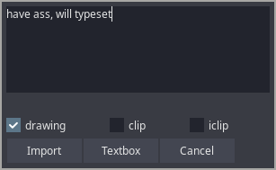

# PhosCity's Aegisub Scripts Collection

1. [Bidirectional Snapping](#bidirectional-snapping)
1. [Wave](#wave)
1. [Wobble](#wobble)
1. [svg2ass](#svg2ass)

## Bidirectional Snapping

**_Available in Dependency Control_**

If you're a timer like me who does not use TPP and times primarily using hotkeys, then you'll be disappointed to know that Aegisub does not have hotkeys specifically for timing. While there are other scripts that allows you snap to keyframes, they are either a simple snap to adjacent keyframes or a TPP style snapping scripts. This one is geared towards timing.

While timing you might have come across the case multiple times where you go to the next line only to realize that the end time of the line overshoots the keyframe you want to snap to. Then you have no choice but to snap backwards using mouse. Here's where this script comes handy. This script is made to be hotkeyed, so first hotkey the end snapping and the start snapping function in the audio section. When you press the hotkey to snap end once, it snaps to the keyframe ahead. If you press the same hotkey again, it snaps to the keyframe behind. Then every press of the hotkey will continue snapping to previous keyframe. This way, you can snap to the keyframe ahead or behind using the same hotkey. For the start time, the opposite happens. One press snaps behind and then double press snaps forward.

I use Bidirectional Snapping in combination with [this script](https://github.com/The0x539/Aegisub-Scripts/blob/trunk/src/0x.JoinPrevious.lua) which is also hotkeyed and allows me to link the previous line to current line without moving to previous line.

An attempt has been made below to showcase it's usage but you should use it yourself to see how it works. Here, `w` has been hotkeyed to end-snapping and `q` has been hotkeyed to beginning-snapping.

https://user-images.githubusercontent.com/65547311/168461607-d575b757-4504-4a31-8c9b-f52d01fe566f.mp4

## Wave

**_Available in Dependency Control_**

Wave is a script that allows you to mimic the wavy signs through some fscx, fscy and fsp trickery. When you open the scripts, there are few parameters you can change and you'll have to go through some trial and error to determine what values give you the result you want.

Credits for the original code excerpt before my modification goes to [The0x539](https://github.com/The0x539)

Below are few examples of what kind of waves you can achieve but depending on the values you use, you can create different types of waves as well.

https://user-images.githubusercontent.com/65547311/164889225-2d8a6ccf-7798-4810-a3cf-3f87568abef0.mp4

## Wobble

**_Available in Dependency Control_**

Wobble is a remake of a very old script that distorts the text with the parameters you choose. The old script however was very difficult to use. It neither recognized the text already present in the line nor the tags used nor did it output the result in a usable format. So I decided to remake it.

When you open the script, you will be presented with the gui as shown above. Imagine that when you use this script, it distorts the text along a wave horizontally or vertically or both. The parameters control the nature of the wave thus controls how the text is distorted. Frequency is the number of waves (crest and trough) you want in the text. Use very small value for useful output. Strength is the number of pixels that the text will be distorted to. With trial and error, you can create many interesting distortions.

As you can see below, the top is the original font and everything below it is distorted using this script. I use it when the sign is distorted or I need a irregular font that I cannot find.

## svg2ass

**_Available in Dependency Control_**

The script svg2ass is a wrapper for a program [svg2ass](https://github.com/irrwahn/svg2ass) which allows you to select a svg file from Aegisub itself and convert it to shape, clip or iclip. It works in both windows as well as unix operating system. I generally create svg files using GIMP(can perform complex selections and convert those selections to svg in a matter of seconds) or Inkscape and use svg2ass to convert them to subtitle lines. If you cannot/ do not want to compile svg2ass, then there is also a [website](https://qgustavor.github.io/svg2ass-gui/) where you can upload the svg file to obtain the output.

The first thing you should do is to set the config and provide the path where you have the svg2ass executable. At the same time, you can also provide custom tags you want to append to final result and the custom svg2ass parameters if you prefer.

To use this script, simply click on `Import` button and select the svg file. The resulting lines will have the same start time, end time and style as the selected line. If you checked clip or iclip in the gui, the resulting shape will be converted to clip or iclip respectively. Alternatively if you don't have the svg2ass executable, you can get the output of svg2ass from the website and paste the result in the textbox and click on the `Textbox` button. The resulting lines will the same as `Import`

