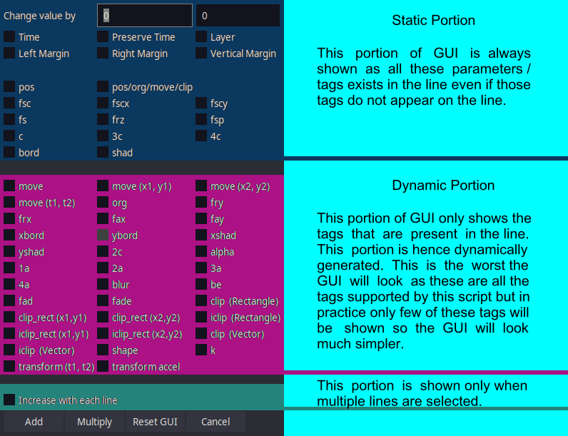

<font color="green">**Available in Dependency Control**</font>

[Link to script](https://github.com/PhosCity/Aegisub-Scripts/blob/main/macros/phos.AddGrain.moon)

The script `Abacus` allows you to recalculate the value of tags in the line. The GUI of this script is dynamically generated such that only tags that are available in the line are shown in the GUI.

{: style="height:611px;width:796px"}

# Buttons

{: style="height:41px;width:352px"}

## Add

This will increase/lower value of selected tags by adding the user specified number. If the input is positive, the tag value will increase and if the input is negative, the tag value will decrease.

## Multiply

This will increase/lower value of selected tags based on given percentage.

For example, if the user specifies 150, you will get 50% increase in the value of specified tag. If user specifies 50, you will get a 50% decrease in the value of the specified tags.

## Reset GUI

The checkboxes you ticked as well as the values you typed last time are remembered and already populate the GUI when you open the script. If you wish to unset all of them at once to get a clean GUI, you click this button. This will close the current GUI and load a clean new GUI.

# Input

There are a few types of input a user can provide.

## Time

Whenever you're dealing with time like line's start time or end time or karaoke tags, the input provided is in time. You can input time in various ways that makes sense. For example, it makes most sense to input time in centiseconds when dealing with karaoke tags.

| Format     | Example    | Remarks                                    |
| :--------- | :--------- | :----------------------------------------- |
| h:mm:ss.ms | 0:01:20.03 |                                            |
| n          | 30         | Time in miliseconds                        |
| nms        | 30ms       | Time in miliseconds                        |
| ncs        | 30cs       | Time in centiseconds                       |
| ns         | 30s        | Time in seconds                            |
| nm         | 30m        | Time in minutes                            |
| nh         | 3h         | Time in hours                              |
| nf         | 3f         | Time in frames (Requires video to be open) |

# Color

For all color related tags, you input r, g and b value separated by comma that will be added/multiplied to current tag. The resulting values are clamped between 0 and 255.

| Format  | Example  |
| :------ | :------- |
| r, g, b | 20,30,40 |

## Number

If the input is neither time or color, it will just be a number.

## Lua Math Expression

While its utility is debatable, this script can accept any valid lua math expressions as input.

Examples.

```lua
5+3
math.sin(5)
math.sin(3)
math.random(-10,10)
```

Lua cannot do float random by default so there is an additional function accpeted: `math.randomfloat(min, max)`.

# Input Boxes

There are two input boxes. Let's call them x-input box and y-input box for now as shown in image below.

{: style="height:72px;width:398px"}

Most of the tags have only one parameter and will use x-input box. There are tags that use both input boxes. Most of them have to do with time or coordinates. The following table shows tags that use both boxes and all other tags use only x-input box.

| Tag                | x-input box                 | y-input box                 |
| :----------------- | :-------------------------- | :-------------------------- |
| time               | start time of line          | end time of line            |
| pos                | start time                  | end time                    |
| pos/org/move/clip  | x coordinate                | y coordinate                |
| move               | x coordinate                | y coordinate                |
| move(t1,t2)        | start time of move tag      | end time of move tag        |
| org                | x coordinate                | y coordinate                |
| fad                | start time of fade tag      | end time of fad tag         |
| clip (Rectangle)   | all x coordinate of clip    | all y coordinate of clip    |
| clip_rect (x1,y1)  | x1 coordinate of clip       | y1 coordinate of clip       |
| clip_rect (x2,y2)  | x2 coordinate of clip       | y2 coordinate of clip       |
| iclip (Rectangle)  | all x coordinate of iclip   | all y coordinate of iclip   |
| iclip_rect (x1,y1) | x1 coordinate of iclip      | y1 coordinate of iclip      |
| iclip_rect (x2,y2) | x2 coordinate of iclip      | y2 coordinate of iclip      |
| clip (Vector)      | all x coordinate of clip    | all y coordinate of clip    |
| iclip (Vector)     | all x coordinate of iclip   | all y coordinate of iclip   |
| shape              | all x coordinate of a shape | all y coordinate of a shape |
| transform (t1,t2)  | start time of a transform   | end time of a transform     |

# Increase with each line

This option will be shown to you if you have selected multiple lines. If this is ticked, your input value will increase by the input amount for each iteration of selected lines. For example, if your input is 1, the first line will have input of 1, second will have input of 2, third line will have input of 3 and so on.

This works for all kinds of inputs mentioned above.
