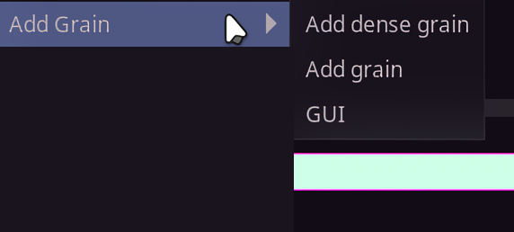

**Available in Dependency Control**

[Link to script](https://github.com/PhosCity/Aegisub-Scripts/blob/main/macros/phos.AddGrain.moon)

The script `Add Grain` allows you to emulate the grain texture in your sign. This script closely follows the manual approach of creating grain from this [guide](<https://fansubbers.miraheze.org/wiki/Guide:Adding_film_grain_(typesetting)>). All you need to do before using this script is to install the grain font from this [link](https://github.com/PhosCity/Aegisub-Scripts/tree/main/misc/Grain%20Font)

# Usage

{: style="height:216px;width:480px"}

You can run this script from the menu as well as from the GUI. `Add grain` from the menu adds simple grain while `Add dense grain` makes the grain a little denser using [shad trick](https://fansubbers.miraheze.org/wiki/Guide:Typesetting/Frequently_asked_questions#What_is_the_shad_trick?). If you want even denser grain than that, you need to use the GUI.

In the GUI, you can increase the `Grain Intensity` to increase the density of the grain. Normally the script makes the grain in pure white and pure black color as recommended in the guide but in cases where you need custom grain color, you can set it in the GUI as well.

## Static Grain

- Cover your sign with `!` as shown in the image above. It is easier to do this if you use `\an7` and break the line using `\N` whenever it goes beyond the sign. You do not need to add or modify any tags like `\fn`, `\bord`, `\shad` etc. The script will do it for you. The only tag you might want to change before adding `!` is `\fsc[xy]`. Higher the value of scale, lighter the grain and vice versa.

- Run the script and choose one of the two options in the menu or from the GUI. The script will, in order, check if the font `grain.ttf` is installed, replace `!` with random characters, split the line to pure white and pure black layers, set the line border and shadow to 0 and add necessary tags like fontnames, color and alpha.

- Adjust the alpha, blur and scale until it looks like surrounding grain.

- Clip the line with grain to the text or shape if required.

## Dynamic Grain

- Cover your sign with `!` as described above for static grain.

- Clip the line to the text or shape if required.

- Split the line into frames using scripts like [Hyperdimensional Relocator](https://typesettingtools.github.io/depctrl-browser/macros/ua.Relocator/) or [SplitTimer](https://typesettingtools.github.io/depctrl-browser/macros/petzku.SplitTimer/). In some cases, you can go further and check if the anime is animated on twos or threes and use `SplitTimer` to split line in `n` frames accordingly instead of splitting into lines with 1 frame each.

- Select all the lines and run the script. The result will be dynamic grain.
