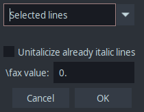
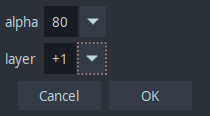
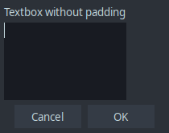
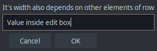
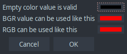
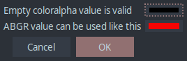

<font color="green">**Available in Dependency Control**</font>

[Link to script](https://github.com/PhosCity/Aegisub-Scripts/blob/main/modules/phos/AegiGui.moon)

!!! warning "Warning"

    This is an experimental module which is still in production. This is not ready for use in any shape or form in actual scripts. Its functionality could change at any time and it could ultimately be scrapped if deemed unfit for use.

# Introduction

I hate making GUIs for Aegisub macros and you do too. This module helps you to create and more importantly modify the GUIs easily and quickly. It was designed to take a single string and convert it to a GUI table that Aegisub accepts. Additionally, the GUI string looks similar to how it will look in Aegisub so you can look at the code itself to get the general idea of how to create and modify the string to get corresponding look in Aegisub.

# Showcase

Let's say we want to make a simple GUI like this:


Then the GUI string will look something like this.

```moon
str = "
| drop,lineselect,Selected lines::All lines,Selected lines | check,unitalic,Unitalicize already italic lines |
| label, \\fax value:                                      | float,faxvalue,0                                |
"
```

Notice that the GUI string looks very similar to how the GUI looks in Aegisub. Now let's say I don't like this and want to change the GUI to look something like this:


All I'd have to do is to modify the string as:

```moon
str = "
| drop,lineselect,Selected lines::All lines,Selected lines |                  |
| check,unitalic,Unitalicize already italic lines          |                  |
| label, \\fax value:                                      | float,faxvalue,0 |
"
```

You can imagine that this change was very trivial to do in the string.
Now finally, lets say I want to add an empty space in the middle of the GUI.



All I'd to do is add `null`.

```moon
str = "
| drop,lineselect,Selected lines::All lines,Selected lines |                  |
null
| check,unitalic,Unitalicize already italic lines          |                  |
| label, \\fax value:                                      | float,faxvalue,0 |
"
```

If this does not convince you to use this module, I don't think anything else in this page will and you can stop reading further. For someone new to making Aegisub GUI, the reason why I believe this showcase is impressive is because if I wanted to add an empty space in the middle like this, I would have to change the coordinates of all the elements that came after this. It's easy in small GUI like this but imagine doing the same in a decently large GUI. If the difference of simply adding `null` versus manually updating every single coordinate of all the items does not impress you, nothing else about this module will.

# Basic Usage

There are three methods provided by this module.

## AegiGUI.create

This method converts the string you pass to tables that can be understood by Aegisub to create GUIs.

| Arguments       | Description                         |
| :-------------- | :---------------------------------- |
| `GUI string`    | String that has all the class info  |
| `BUTTON string` | String that has all the button info |

| Returns         | Description                                                            |
| :-------------- | :--------------------------------------------------------------------- |
| `GUI table`     | Table that can be fed to aegisub.dialog to create GUI                  |
| `BUTTON table`  | Table that can be fed to aegisub.dialog to create buttons              |
| `BUTTON ids`    | Table that can be fed to aegisub.dialog to assign ID to buttons        |
| `Error Message` | Any error messages that the module might have found in your GUI string |
| `Error Level`   | 0 means non-fatal errors while 1 means fatal errors in your GUI string |

```moon
gui = AegiGUI.create str
aegisub.dialog.display(gui)

gui, button = AegiGUI.create str, btn
aegisub.dialog.display(gui, button)
```

## AegiGUI.debug

This method is supposed to be used only when you are writing a script. Normally when there are fatal errors, the module will show you those errors as they generally mean GUI cannot be initialized. However, all non-fatal errors are suppressed. As a script author, you should fix them as well since they could have undesired effects and could have been caused by some oversight.

So this method collects them and shows you giving an opportunity to fix them. After you fix them, initializing GUI is as easy as changing `AegiGUI.debug` to `AegiGUI.create`.

!!! note "Note"

    This method does not initialize any GUI. In fact this stops any further execution of the script and only shows if there are any issues initializing the GUI string or not.

| Arguments              |
| :--------------------- |
| Same as AegiGUI.create |

| Returns |
| :------ |
| Nothing |

```moon
AegiGUI.debug str

AegiGUI.debug str, btn
```

## AegiGUI.open

This method not only converts the string but also uses that table to initialize the GUI so you don't have to.

| Arguments              |
| :--------------------- |
| Same as AegiGUI.create |

| Returns   | Description                                                       |
| :-------- | :---------------------------------------------------------------- |
| `pressed` | String or boolean that shows info about which buttons was pressed |
| `result`  | Table that contains values of all the items of the GUI            |

!!! note "Note"

    `pressed` is boolean false if button with `cancel` id is pressed. Similarly, it is boolean true if button with `ok` id is pressed. It is string i.e. button name which was pressed for custom buttons.

```moon
pressed, result = AegiGUI.open str

pressed, result = AegiGUI.open str, btn
```

## AegiGUI.merge

This method allows you to merge two gui strings. It can directly open the gui and return pressed button and gui result or it can just return the combined gui table that can be fed to aegisub.dialog.

| Arguments           | Description                                                                  |
| :------------------ | :--------------------------------------------------------------------------- |
| `Source GUI string` | The gui string that you want another gui string be appended to               |
| `Target GUI string` | The gui string that you want to appended to another gui string               |
| `BUTTON string`     | String that has all the button info                                          |
| `x Offset`          | All elements in target GUI string will be ofset by this amount (Default = 0) |
| `y Offset`          | All elements in target GUI string will be ofset by this amount (Default = 0) |
| `open`              | Boolen if you want to open the merged gui(Default = false)                   |

| Returns        | Description                                                     |
| :------------- | :-------------------------------------------------------------- |
| `GUI table`    | Table that can be fed to aegisub.dialog to create GUI           |
| `BUTTON table` | Table that can be fed to aegisub.dialog to create buttons       |
| `BUTTON ids`   | Table that can be fed to aegisub.dialog to assign ID to buttons |

```moon
gui  = AegiGUI.merge str1, str2, "Apply, Cancel:cancel", 1, 1
aegisub.dialog.display(gui)

pressed, res = AegiGUI.merge str1, str2, _, 25, 0, true
```

# Formatting the GUI string

There are a few rules that the GUI string follows:

1. Every class will be enclosed by `|` character. A space between two `|` is called a cell like a spreadsheet cell.
1. One cell has an width of 1 and height of 1 in GUI table.
1. There will be equal number of cells in each line of GUI string. This effectively means there will be equal number of `|` in each line.
1. `null` is a special keyword that tells the module to leave that cell or that whole row alone. If all cells in a row is empty, it is equivalent to a `null` row.
1. An empty cell means the width of this cell will be added to whatever non-empty cell it finds before it in its row. (Unless it encounters a `null` cell before it finds a non-empty cell.)
1. If there is a text (for textbox or label class for example) that has characters like `\n`, `,` or `|`, the whole text must be enclosed inside `[[...]]` to escape them. Naturally you cant use `[[]]` in any text. Hopefully you never have its need.

## List of all classes

| Class      | Alias | Argument 1 | Argument 2       | Argument 3 | Argument 4 | Argument 5 | Argument 6 | Remarks        |
| :--------- | ----- | ---------- | ---------------- | ---------- | ---------- | ---------- | ---------- | -------------- |
| label      | -     | label      | -                | -          | -          | -          | -          | -              |
| edit       | -     | name       | text (opt)       | hint (opt) | -          | -          | -          | -              |
| textbox    | text  | name       | height           | text(opt)  | hint(opt)  | -          | -          | -              |
| checkbox   | check | name       | label            | value(opt) | hint(opt)  | -          | -          | -              |
| intedit    | int   | name       | value(opt)       | min(opt)   | max(opt)   | hint(opt)  | -          | -              |
| floatedit  | float | name       | value(opt)       | min(opt)   | max(opt)   | step(opt)  | hint(opt)  | -              |
| dropdown   | drop  | name       | items            | value(opt) | hint(opt)  | -          | -          | -              |
| color      | -     | name       | colorstring(opt) | hint(opt)  | -          | -          | -          | -              |
| coloralpha | -     | name       | colorstring(opt) | hint(opt)  | -          | -          | -          | -              |
| alpha      | -     | name       | alphastring(opt) | hint(opt)  | -          | -          | -          | -              |
| pad        | -     | value      |                  |            | -          | -          | -          | Non-Aegi class |

## label

{ align=right }

```moon
str = "
| label, Label 1          | label, Label 2          | label, Label 3 |
| label, Label of width 3 |                         |                |
|                         | label, Label of width 2 |                |
| label, Label of width 1 | null                    |                |
"
```

{ align=right }

```moon
lblStr = "This is a string in variable."
str = "
| label, #{lblStr}                                   |
| label, [[Escaping illegal characters like , or |]] |
"
```

## intedit

{ align=right}

```moon
str = "
| label, Basic intedit class          |
| intedit, int1, 10                   |
| label, With alias                   |
| int, int2, 10                       |
| label, with minimum value           |
| int, int3, 10, 0                    |
| label, with maximum value           |
| int, int4, 10, _, 100               |
| label, with both max and min value  |
| int, int5, 10, 0, 100               |
| label, with hint                    |
| int, int6, 10, _, _, This is a hint |
"
```

<br/><br/>

## floatedit

{ align=right }

```moon
str = "
| label, Basic floatedit class                |
| floatedit, float1, 1.5                      |
| label, With alias                           |
| float, float2, 1.5                          |
| label, with minimum value                   |
| float, float3, 1.5, 0                       |
| label, with maximum value                   |
| float, float4, 1.5, _, 10.5                 |
| label, with both max and min value          |
| float, float5, 1.5, 0, 10.5                 |
| label, [[with both max,min and step value]] |
| float, float6, 1.5, 0, 10.5, 0.5            |
| label, with hint                            |
| float, float7, 1.5, _, _, _, This is a hint |
"
```

<br/><br/>
<br/><br/>

## checkbox

{ align=right }

```moon
str = "
| label, Basic checkbox class                 |
| checkbox, chk1, Checkbox 1                  |
| label, With alias                           |
| check, chk2, Checkbox 2                     |
| label, Force true value                     |
| check, chk3, Checkbox 3, true               |
| label, Force false value                    |
| check, chk4, Checkbox 4, false              |
| label, With hints                           |
| check, chk5, Checkbox 5, _, This is a hint. |
"
```

## dropdown

This one was a bit tricky because you have to pass a table to dropdown items so all table items are delimited by `::` which is then converted to table by the module.

{ align=right }

```moon
str = "
| label, Basic dropdown class |
| dropdown, drp1, 1::2::3, 1  |
| label, With alias           |
| drop, drp2, item1::item2    |
"
```

Since tables can mostly be quite large, it is better to create the table outside the GUI string and append it later.

{ align=right }

```moon
alfa = {"00","20","30","40","50","60","70","80","90","A0","B0","C0","D0","F0"}
drop_alfa = table.concat(alfa,"::")..","..alfa[8]

layer = {"-5","-4","-3","-2","-1","+1","+2","+3","+4","+5"}
drop_layer = table.concat(layer,"::")..","..layer[6]

str = "
| label, alpha | drop, alpha, #{drop_alfa}  |
| label, layer | drop, layer, #{drop_layer} |
"
```

## textbox

This is the point where you will feel like this module is held with nothing but a duct tape and for good reason. `textbox` is notoriously hard to work with in complex GUIs. When I tell Aegisub to make a textbox that is one has width 1, how wide is that? Nobody knows. That width is in fact equal to the longest width of other items in that column. What if there are no other items in that column. Well then your textbox has no width. Lets say your textbox has a certain width and I set its width to two. Does that mean its width has been doubled? No again. Its width is sum of longest element of each column. Because of this nature of textbox where its width depends on dimensions of other elements in that row, there is no deterministic way to make textbox. Textbox is always hard to get right without some trial and error and unfortunately, this module does not solve this issue.

This module does provide a class called `pad` which can force a cell to be a certain characters wide which will help use maintain the width of a textbox.

{ align=right }

```moon
str = "
| label, Textbox without padding |
| text, txt1, 5                  |
|                                |
|                                |
|                                |
|                                |
"
```

Notice that textbox is as wide as the label above it. If the label was shorter, the textbox would be less wide as well. Also notice that since I gave it the height of 5, I have to add five empty cells (counting itself) below it.I could also add `null` to get the same effect instead of empty cells.

{ align=right }

```moon
str = "
| label, Textbox with padding | pad, 50 |
| text, txt1, 5               |         |
|                             |         |
|                             |         |
null
null
"
```

Here I padded the second column by 50 characters which made the textbox longer than the first example. I also mixed empty cells and `null` lines to show that they effectively work as the same.

{ align=right }

```moon
textboxValue = "My name is Yoshikage Kira. I'm 33 years old. My house is in the northeast section of Morioh, where all the villas are..."

str = "
|label, Textbox with value       |null |label, Using variable as value    |
|text, txt1, 5, This is some text|pad,5|text, txt2, 5, [[#{textboxValue}]]|
null
null
null
null
"
```

Here I put value inside the textbox. In the second box, I put the text from a variable that was put inside `[[..]]` so that any illegal characters inside can be escaped. Additionally, padding here is not to add width to textbox but to separate two textboxes.

## edit

{ align=right }

```moon
str = "
| edit, edit1 |
"
```

At the very least, width 1 of edit class has some default width.

{ align=right }

```moon
str = "
| label, It's width also depends on other elements of row|
| edit, edit1, Value inside edit box                     |
"
```

Width of edit class is also dependant on longest element of that column so that can be manipulated just like we manipulated width of textbox.

## color

{ align=right }

```moon
str = "
| label, Empty color value is valid      | color, cl1            |
| label, BGR value can be used like this | color, cl2, &H0405F7& |
| label, RGB can be used like this       | color, cl3, #F70504   |
"
```

## coloralpha

{ align=right }

```moon
str = "
| label, Empty coloralpha value is valid  | coloralpha, cl1              |
| label, ABGR value can be used like this | coloralpha, cl2, &HAA0405F7& |
"
```

# Buttons

Button string is optional. If you do not pass button string, you will get a default `OK` and `Cancel` buttons.

A simple button string looks like this:

```moon
btn = "Button 1,Button 2"
```

If you want to provide button IDs to a specific button, the button string looks like this:

```moon
btn = "Button 1:ok, Button 2:cancel"
```

This will assign `Button1` with `ok` button ID and `Button2` with `cancel` button ID. To see which button IDs are valid, see [here.](https://aegisub.org/docs/latest/automation/lua/dialogs/#dialog-button-ids)

If you want multiple custom buttons, you can assign a specific class to specific button.

```moon
btn = "Button 1,Button 2, Button 3:cancel"
```

This will make `Button3` return boolean false and every other button returns button name.

# Some minor things that the module will handle for you

1. Unless an argument for a class is stated to be optional, every argument must be supplied. It will raise fatal errors if you do not.
1. If you do not provide optional arguments, default value will be used for them. Please be aware of their default values when you skip them.
1. If you provide more arguments than is necessary for a class, they will be ignored with non-fatal warnings.
1. Every arguments type will be checked and if it does not match, fatal error will be raised.
1. If you provide float number when an argument demands an integer, every value after decimal will be truncated with non-fatal error raised. (This is default behaviour for intedit class in Aegisub)
1. All elements of list in dropdown must be unique. If they are not, duplicated items will be dropped with non-fatal warnings.
1. All names of class must be unique. If they are not, fatal error is raised.

# Some Tips

- You can use a spreadsheet tool like **Excel** or **LibreCalc** to create the basic structure of the GUI string. Pop in the values in the cells like you want to see them in the GUI and save it as csv file with `|` as a delimiter. This will do most of the work for you. You can now clean up the text and fix anything if necessary.

- There is actually no need for any formatting as long as the rules of GUI strings are followed. You don't need to align the cells like I did in examples. You don't need to strip spaces around the cell as well. However doing so will give you a better picture of how the GUI will look by looking at the code itself which will only benefit you. I personally use neovim and use [this plugin](https://github.com/junegunn/vim-easy-align) to automagically format them. You could also pop the string in a markdown file and use formatter like prettier to format it as markdown tables. Alternately, format it manually with bunch of spaces.

- All the examples in this page along with two of the GUIs from my own script has been made into a script [here](https://github.com/PhosCity/Aegisub-Scripts/blob/main/docs/examples/AegiGUI.moon).

# This module may not be for you

While this module does a lot of what I imagined it to do, it is not a perfect alternative to how we traditionally made Aegisub GUI. While I was able to easily replicate the GUIs of of my own scripts, when I tried to replicate unanimated's behemoth of GUIs, it still amounted to a lot of frustration. Unanimated merges a lot of cells and adds a ton of elements in a single GUI so that did not help the matter at all.

To spin this weakness to its strength, I guess this module forces you to write simpler GUIs because if you want an easier time writing a GUI using this module, you need to keep your elements aligned to grids majority of the time. Keep your GUIs simple and this module will surely make the job easier for you.
