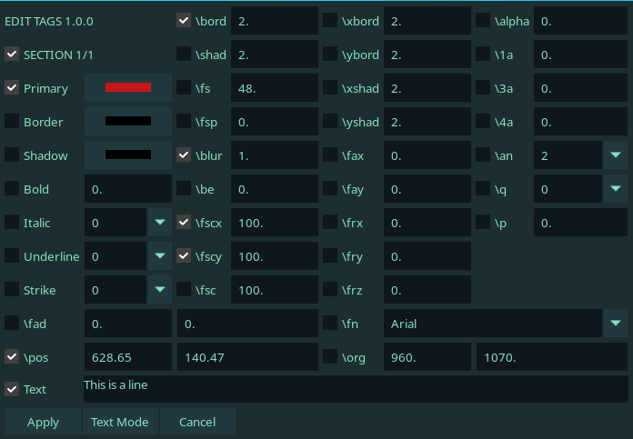
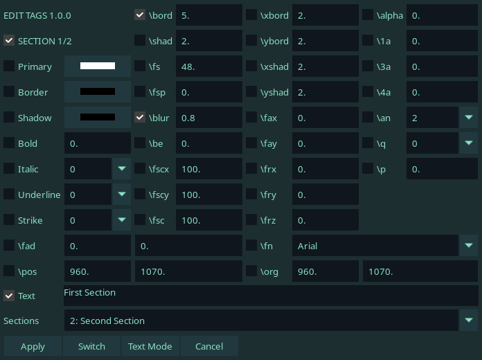
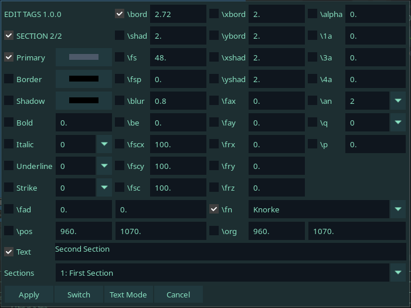
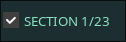
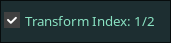
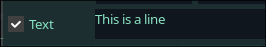

**Available in Dependency Control**

[Source to script](https://github.com/PhosCity/Aegisub-Scripts/blob/main/source/phos.EditTags.norg)

[Link to script](https://github.com/PhosCity/Aegisub-Scripts/blob/main/macros/phos.EditTags.moon)

# Introduction

**Edit Tags** is a script that, as the name suggests, allows you to edit tags in your line. If you are manually editing tags by going into the textbox, I believe you're doing it wrong. You are not only likely to create malformed tags if you're not careful enough, it is also hard to edit tags in a line that has a fairly complex set of tags. Imagine trying to find `frx` in the ocean of tags like this and this is not even the most complex line I can think of.

{\blur2\c&H6E5A66&\fscx35.2\fscy33.44\fax-0.29\frz16.86\pos(544,146)\b1\alpha&HC0&\fry348}C{\fscx35.27\fscy33.49}h{\fscx35.38\fscy33.61}i{\fscx35.51\fscy33.74}n{\fscx35.68\fscy33.9}e{\fscx35.88\fscy34.09}s{\fscx36.09\fscy34.29}e{\fscx36.32\fscy34.51} {\fscx36.56\fscy34.74}F{\fscx36.83\fscy34.99}o{\fscx37.11\fscy35.25}o{\fscx37.4\fscy35.53}d

Many will notice the similarity of this script with another popular script [**HYDRA**](https://typesettingtools.github.io/depctrl-browser/macros/ua.HYDRA/). It is true that there is a significant overlap between the features of these scripts. However, it is also true that both of these scripts do things that other script does not. Unlike **HYDRA**, this script only has one head and only does things related to editing complex lines. I personally use both when it makes sense to use it.

# Single Line Mode

If you only select a single line before running the script, this mode is run.

## Example 1

Imagine you have the following line and you run the script.

<pre>
{<b><b>\p</b>os</b>(628.65,140.47)<b>\fscx</b>100<b>\fscy</b>100<b>\bord</b>2<b>\1c</b>&H1718C3&<b><b><b>\b</b>lur</b></b>1}This is a line</pre>

The GUI produced will look something like this:

Notice that the GUI is already pre-filled with some values. These values are the effective values of these tags in this line. You can also notice that the tags that are present in the line are ticked.

Now you can do the following things:

1. Change the values of ticked tags to modify the values of these tags.
1. Tick the unticked tags to insert those tags in the line.
1. Untick the ticked tags to remove those tags from the line.

## Example 2

Now imagine you have the following line where you have two tag sections and two text sections.

<pre>
{<b>\bord</b>5<b><b><b>\b</b>lur</b></b>0.8}First Section{<b>\fn</b>Knorke<b>\bord</b>2.72<b>\c</b>&H69594D&}Second Section</pre>

Then the GUI produced will be something like this:

It looks just like before but there are two major difference:

1. There is now a new drop-down in the bottom of the GUI that consists of all sections of the line.
1. There is a new button called `Switch` that didn't exist before.

You will also notice in the top-left of the GUI, `SECTION 1/2` indicates that first section of the two is currently selected. The ticked tags in the GUI also reflects the first tag section. Any changes you make in this GUI will also only apply to the first tag section.

In the drop-down at the bottom, you will notice that the next section is already selected. If you press `Switch` button now, you will now switch to the next section.

The selected tags in this GUI also reflects the second tag block. The changes you made to the tags in the first tag section is not lost on switch. You can switch back and forth between sections, make changes to tags as you switch and when you finally click `Apply` button, the changes you made to each sections will apply to respective tag sections.

You can select any section in the drop-down to switch directly to that section. You don't have to switch in chronological order. At this point, it should be clear to you how you can make granular change to any section in your line.

## Example 3: Transforms

Here's a line with transforms

<pre>
{<b>\bord</b>1.98<b><b><b>\b</b>lur</b></b>0.53<b><b><b>\t</b></b></b>(0,200,<b>\bord</b>0)<b><b><b>\t</b></b></b>(200,500,<b><b><b>\b</b>lur</b></b>25)}This is a line</pre>

If you open a line with transforms, then you'll see that your GUI will now have a new button called `Transform`.

If you press the button, you will be greeted with a new GUI.

You actually already know how to use this GUI because this is just a mini version of what we did earlier. The GUI only shows transformable tags but other than that the way you edit transforms is just similar to how you work with other tags. If there are multiple transforms, you can switch between those transforms using drop-down menu.

# Multi-Line Mode

When you select multiple lines and run the script, this mode is run.

This is similar to **HYDRA**. You tick the tags, change the value and click `Apply`. It will modify or insert those tags in all selected lines.

There is really nothing more to this mode other than this section:

Here you can select which tag section, layer or style and the tags will only apply to those selection only. By default, it will apply to start tag section, all layers and all styles.

# Text Mode

You must have seen a button called `Text Mode` in the images above. The text mode is simply a glorified `Find and Replace` page where you can make changes to multiple tags and apply it at once.

Tags are de-duplicated so if a tag has same value in multiple places, it will only show once in the GUI and if you change it, it will be changed in all places.

To make a change, just edit the value in the text box for as many tags as you want and click `Modify`. If you want to delete a tag, simply delete the whole line and keep that line empty. (Do not remove the line.)

!!! warning "Warning"

    Text mode is a lawless zone. It give you more freedom but does not validate what changes you make. Garbage in, Garbage out. It's easy to create malformed tags if you're not careful.

# Text Editing

Even though this script is called `Edit Tags` and not `Edit Text`, you can in fact edit text of a section. Just modify the text in the text-box that is at the bottom of GUI and it'll be saved when you click `Apply`. This is not available in multi line mode.

# Section Deletion

Did you notice there is a tick box beside tag section?

It's there for a reason. You can actually untick it to delete the whole tag section. If you untick a tag section and switch to another tag section and then you change your mind, you can actually switch back to this section and tick it again to avoid removal.

You can do the same for transform.

And for text as well.

# Some opinionated decisions

I've made some decisions that everybody may not agree with.

1. Vectorial clips and karaoke tags are not included in the GUI. I think it makes more sense to edit them using Aegisub itself.
1. Rectangular clips, move and complex fade are only shown in GUI if they are present in the line. This was mainly done because if they were shown by default, the GUI became uglier. This does mean that you can't create these tags using the script. I'm more likely to revert this if people want.
1. Alpha is expressed in percentage where 0 means opaque and 100 means transparent. HYDRA offered a drop-down menu with few alpha values and you were forced to disliked that and now you'll have to use percentage.
