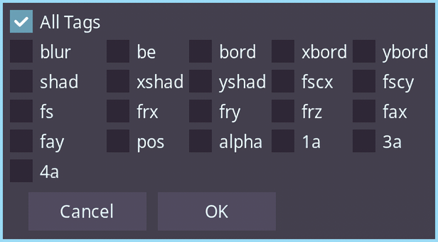

**Available in Dependency Control**

[Link to script](https://github.com/PhosCity/Aegisub-Scripts/blob/main/macros/phos.ExtrapolateTracking.moon)

When you're motion-tracking a sign, and you cannot track the first or last few frames either because the sign moved out of the screen or it faded out, you can use this script to extrapolate the tracking for those lines.

What this script does:

- Gathers position, scale and rotation data from selected lines
- Uses k-fold cross validation to find a proper degree of polynomial to fit the data (and some other fuckery when proper degree cannot be found.)
- Uses that degree to extrapolate the data
- Generates motion tracking data from the extrapolated data
- Uses Aegisub Motion internally to apply that motion tracking data

# Screenshot

{: style="height:180px;width:355px"}

# Usage

!!! warning "Requirements"

    - All selected lines must be 1 frame long.
    - Selection must be consecutive and sorted by time.
    - If lines are split in layers, run the script separately for each layer.

- Try your best to track using Mocha or Blender. It's better to get proper track for as many frames as you can.
- Apply the motion tracking data to the line. Delete the badly tracked lines in the beginning or end if necessary.
- Select all the lines and run the script.
- Choose if you want to extrapolate at start or end using the drop-down in GUI.
- Enter how many additional frames you want to extrapolate.
- Click on `Apply` button.

# Examples

!!! info

    The graph generated in the video is for demonstration and debuggin purposes only. It'll not pop up everytime you use script.

## Extrapolation of linear track

<video width="960" height="540" controls>
  <source src="../assets/extrapolate-linear.mp4" type="video/mp4">
Your browser does not support the video tag.
</video>

## Extrapolation of non-linear track

<video width="960" height="540" controls>
  <source src="../assets/extrapolate-non-linear.mp4" type="video/mp4">
Your browser does not support the video tag.
</video>

## Extrapolation of circular track

!!! warning

    In some cases like in the example shown below, when the line rotates about a single origin point, you should disable `Origin` in the gui for proper extrapolation.

<video width="960" height="540" controls>
  <source src="../assets/extrapolate-circle.mp4" type="video/mp4">
Your browser does not support the video tag.
</video>
