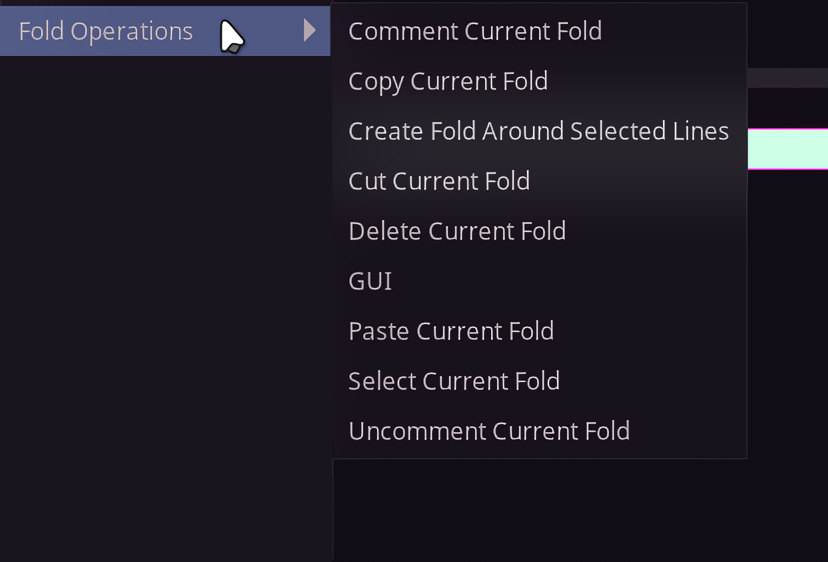
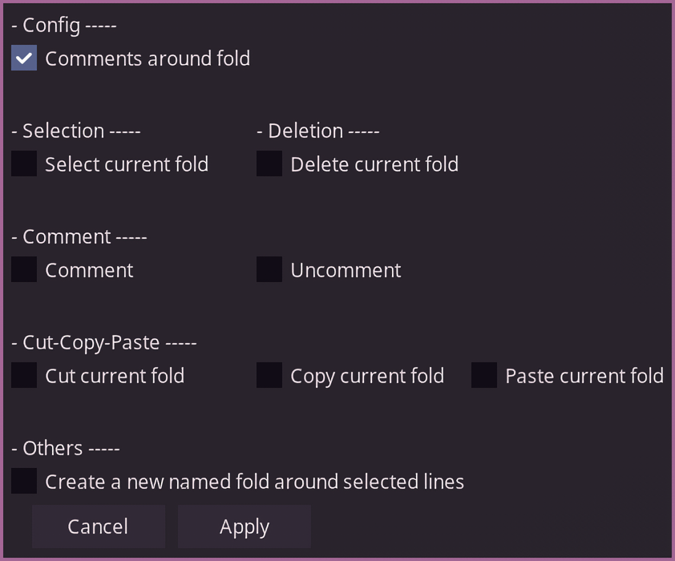

**Available in Dependency Control**

[Link to script](https://github.com/PhosCity/Aegisub-Scripts/blob/main/macros/phos.FoldOperations.moon)

If you use [arch1t3cht's Aegisub](https://github.com/arch1t3cht/Aegisub), then it comes with a feature to visually group and collapse lines in the subtitle grid called folds.

This script allows you to perform various operations on such folds.

!!! info

    The whole point of this script is to perform operations on all lines of a fold at once. So if you are in any line of a fold and you run the script, it'll affect all the lines in that fold which means in many cases, you don't even need to open fold to run these operations in that fold.

# Screenshots

Fold Operations Menu:

{: style="height:281px;width:414px"}

Fold Operations GUI:

{: style="height:350px;width:421px"}

# Usage

Before I explain the usage of this script, there are two popular ways I've noticed people use folds. One is to simply select all the lines and create folds and another is to add commented lines at the start and end of lines where the first line has name for the fold. If you use commented lines, go to the GUI of the script and tick `Comments around fold` under config before doing anything else.

=== "Fold with comments"

    

=== "Same fold without comments"

    

!!! tip

    I personally prefer to use comments around my fold since it is cleaner and instantly allows me to recognize the signs among the list of folds. This script has an operation that will allow you to easily create named folds with comments.

## Operations

### `Select Current Fold`

This selects all the lines in the fold. If you want to, for example, run `ASSWipe` on all lines in a fold, use this to select all the lines and wipe.

### `Create Fold Around Selected Lines`

Select all the lines which you want to add to fold and run this. A GUI will prompt you to enter name for the fold. The script will then insert commented lines with name and create a fold with selected lines.

### `Comment Current Fold`

This comments all the lines in current fold. If a line was already commented before running this, the script remembers it.

### `Uncomment Current Fold`

This uncomments all the lines in current fold. If the script remembers that a line was commented before running `Comment Current Fold`, it does not uncomment them.

### `Delete Current Fold`

This deletes all the lines of current fold.

### `Copy Current Fold`

This copies all the lines in the current fold along with it's fold state and styles to system clipboard.

### `Cut Current Fold`

This copies all the lines in the current fold along with it's fold state and styles to system clipboard and deletes the fold.

### `Paste Current Fold`

This pastes all the lines in a fold that was copied or cut using this script. The fold copied from one Aegisub window can be pasted in the same or different Aegisub window.

!!! info

    If the file in another Aegisub window does not have styles of copied lines, those styles will also be added to new file.

<video width="960" height="540" controls>
  <source src="../assets/fold-copy-paste.mp4" type="video/mp4">
Your browser does not support the video tag.
</video>
