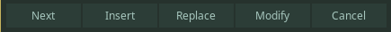
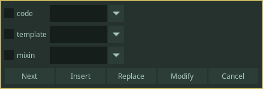

**Not Available in Dependency Control**

[Link to script](https://github.com/PhosCity/Aegisub-Scripts/blob/main/macros/phos.kfx.moon)

This script is designed to write or modify karaoke template lines for [The0x539's KaraTemplater](https://github.com/The0x539/Aegisub-Scripts/blob/trunk/src/0x.KaraTemplater.moon)

<video width="960" height="540" controls>
  <source src="https://user-images.githubusercontent.com/65547311/177035842-e1a4b930-07b8-4ea0-82a2-16a3de8552e6.mp4
" type="video/mp4">
Your browser does not support the video tag.
</video>

#### Buttons

- Next: Proceed to next step
- Insert: Insert a new line above the current selected line
- Replace: Replace the current selected line
- Modify: Modify the template in the current selected line

#### First Window - Line Marker

The first window allows you to select line markers. You won't be able to proceed unless you select a line marker.

#### Second Window - Modifiers

The second window allows you to choose modifiers. This is not compulsory, and you can proceed without choosing anything. For modifiers that need extra arguments, you can type them in the textbox. The options are dynamic i.e. only the modifiers available for the chosen line markers are available for choosing.

#### Third Window - Effect

The third window allows you to write the actual effects. If you chose `code` line marker, a text box will appear where you can write your code. Variables can be written one variable per line. Function can be written as you write in your IDE. Indentation is purely visual and not necessary, but you can indent with tabs or spaces if you wish.

For any other line marker, a HYDRA type GUI will appear. Every box is a textbox so that you can write value, variables or function. If you don't find any option for what you want to write, the `Additional` option is for you.

If you tick transform, this same GUI will be reloaded for you to write tags inside the transform section.

In the bottom, there are boxes for the effect, actor and text. While these are for giving you information of current state of template line, you can edit it manually, and it will be saved.
