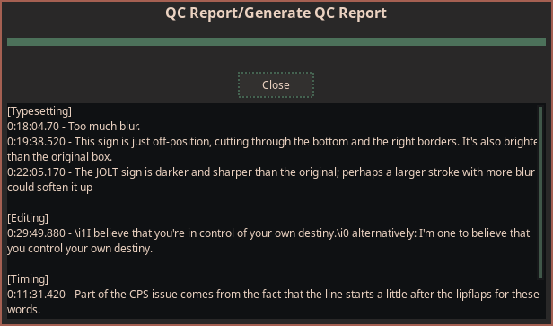

**Not Available in Dependency Control**

[Link to script](https://github.com/PhosCity/Aegisub-Scripts/blob/main/macros/phos.qcreport.moon)

This script is designed to write and generate QC reports from Aegisub. If you wish to write QC reports using a media player, there is a program called [mpvQC](https://github.com/mpvqc/mpvQC) which is designed to do just that.

The top row of the GUI consists of configurable sections like timing, typesetting etc. that you can tick to specify the type of note. If nothing is ticked, it's treated as a general note. Below that is a drop-down which has pre-made reports for each sections for making even faster notes.

Below that is a textbox where you are free to write you report. The way you format your report in the textbox is preserved. If you selected any pre-made reports, it is appended to the beginning of the text in the text-box. You can leave this box empty and only select the pre-made report.

Finally, there is a checkbox called `Use video frame`. Normally, the report is added to current line but if you tick this, the report is added on the basis of the current video frame. If the current video frame has a subtitle, then the report is added to that line. If there isn't, then an empty line with report is inserted whose time is same as the video frame.

After you write all your notes, you can generate a report and a properly formatted note will with time will be generated that you can copy and share. The generated report is fully compatible with arch1t3cht's [Note Browser](https://github.com/arch1t3cht/Aegisub-Scripts#note-browser) script. After you generate the report, and you no longer need them in your subtitle, you can clean them up too.

There is also a config where you can configure a lot of things about the script so be sure to check that out.
