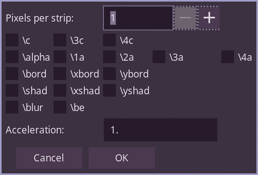

**Available in Dependency Control**

[Link to script](https://github.com/PhosCity/Aegisub-Scripts/blob/main/macros/phos.RotateGradient.moon)

{: style="height:233px;width:344px"}

`Rotated Gradient` allows you to create a gradient at an angle using clips. Traditionally, to create a rotated gradient, you'd have to create a small strip of shapes. That would make it impossible to edit the sign afterwards.

# Usage

<video width="960" height="540" controls>
  <source src="https://user-images.githubusercontent.com/65547311/180961066-708b636b-60e3-450c-bb42-395cfcda7298.mp4" type="video/mp4">
Your browser does not support the video tag.
</video>

- Ready the text or shape which you want to gradient.

- Duplicate the line and change tags in the duplicated line.

!!! info

    You can duplicate it twice to have 2 stop gradient. This basically means duplicate the line `n` times to create `n` stop gradient

- Draw 3 point vectorial clip in clockwise direction in any of the line. The first two points determines the direction of gradient and the last point determines the distance upto which the gradient must continue.

- Run the script. In the GUI, select the pixel for each line, accel and tick all the tags you want to gradient.

!!! warning

    If your text has border and shadow, you must split the lines into layers with and without border and then depending on if you want to gradient fill or border and shadow, run the script in that layer. Otherwise, you may see strips in you line. This is not a limitation of this script. This is limitation of ASS rendering.
