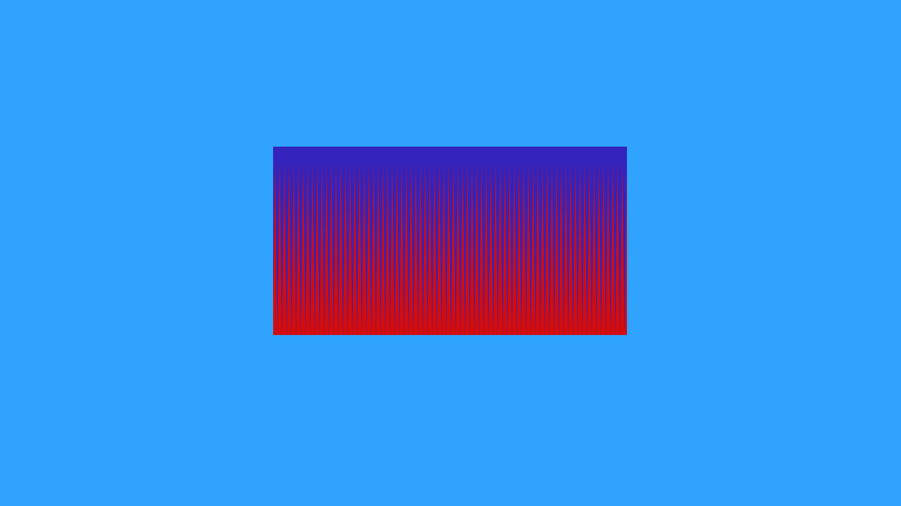

**Not Available in Dependency Control**

[Link to script](https://github.com/PhosCity/Aegisub-Scripts/blob/main/macros/phos.VectorGradient.moon)

The original idea for using vector shapes to create gradient was shared by [Noroino Hanakao](https://github.com/noroinohanako) . This script only automates this process.

The main idea is that this script creates shapes that when blurred gives you a gradient. The main benefit of using this over clip gradient is that this can create gradient in one line which makes it easier to motion track and manipulate.

# Usage

<video width="960" height="540" controls>
  <source src="../assets/vectorGradient.mp4" type="video/mp4">
Your browser does not support the video tag.
</video>

| Name  | Number of clip points | Gradient type |
| ----- | --------------------- | ------------- |
| Wedge | 3                     | Linear        |
| Ring  | 2                     | Radial        |
| Star  | 2                     | Radial        |

- Create the vectorial clip with the required number of clips. For wedge, create the clip in clockwise direction.

- Run the script and choose which type of gradient you want.

# Examples

Example 1:

=== "Rectangular mask gradient"

    

=== "Same mask without blur"

    

Example 2:

=== "Text gradient"

    

=== "Same text without blur"

    
