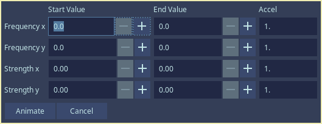

**Available in Dependency Control**

[Link to script](https://github.com/PhosCity/Aegisub-Scripts/blob/main/macros/phos.wobble.moon)

Wobble is a remake of a very old script that distorts the text with the parameters you choose. The old script however was very difficult to use. It neither recognized the text already present in the line nor the tags used nor did it output the result in a usable format. So I decided to remake it and add other features.

When you open the script, you will be presented with the GUI as shown above. Imagine that when you use this script, it distorts the text along a wave horizontally or vertically or both. The parameters control the nature of the wave thus controls how the text is distorted. Frequency is the number of waves (crest and trough) you want in the text in percentage. You'll most likely use 20-40% for optimum results. Strength is the number of pixels that the text will be distorted to. With trial and error, you can create many interesting distortions.

As you can see below, the top is the original font and everything below it is distorted using this script. I use it when the sign is distorted or I need an irregular font that I cannot find.

#### Animate the distortion

If you want to animate the distortion, first split the line to frames. You can use something like [petzku's script](https://github.com/petzku/Aegisub-Scripts/blob/master/macros/petzku.SplitTimer.moon) to do so. You can control the speed of animation by controlling the number of frames each line has. The more frames per line, the slower the animation. After splitting the line to frames, you need to put the starting value and ending value. I recommend you figure this out beforehand by using main GUI. After you put the starting and ending value for all the required elements, click on `Animate` and the script will handle the rest.

  
Click here to see example animations

  
<video width="960" height="540" controls>
  <source src="https://user-images.githubusercontent.com/65547311/179356858-4179c754-93ad-4bdf-b4fe-befc0546d33e.mp4" type="video/mp4">
Your browser does not support the video tag.
</video>

<video width="960" height="540" controls>
  <source src="https://user-images.githubusercontent.com/65547311/179356862-a29a5b9d-9cb3-4cb9-b7c2-e6c5269063ef.mp4" type="video/mp4">
Your browser does not support the video tag.
</video>

