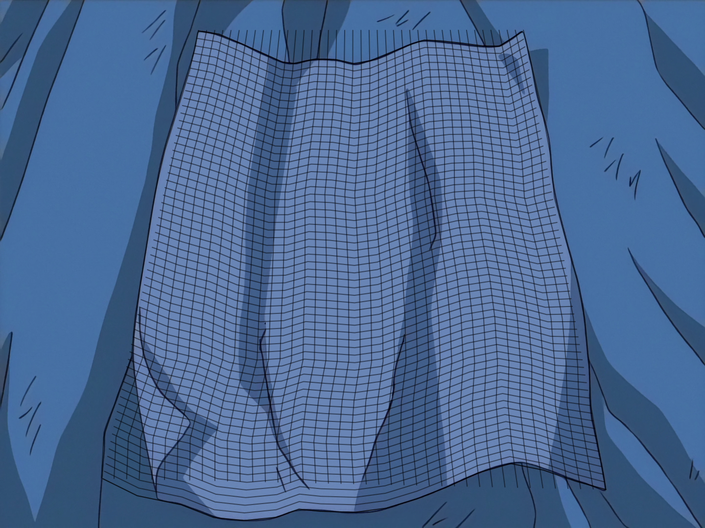

**Available in Dependency Control**

[Link to script](https://github.com/PhosCity/Aegisub-Scripts/blob/main/macros/phos.terrain.moon)

The script `terrain` allows you to interpolate between two vectorial clips with equal
number of points. The idea is that if those two clips follows the "terrain" of
the surface, the interpolated values will trace the surface between them.

## Steps

- Add a vectorial clip with two points where each point is the end of the edge you
  are trying to trace. Do the same for another edge. Now you have two lines with
  clips of two points.
- Select both of them, open the script. Enter the number of intermediate points.
    The more the accurate. Then click the "Add Intermediate Points" button. This
    will new points in the clips you made.
- Now move the intermediate points such that it traces the edge of the surface.
- Select both the lines and open the script again. Enter the number of intermediate
    contours you want and click the "Create Terrain" button. The interpolated lines
    will be added.
- You can do both horizontal and vertical contours. If your surface is complicated,
    you can do this multiple times for more accuracy.

## Example

<video width="2560" height="1546" controls>
  <source src="../assets/terrain_example.mp4" type="video/mp4">
Your browser does not support the video tag.
</video>

